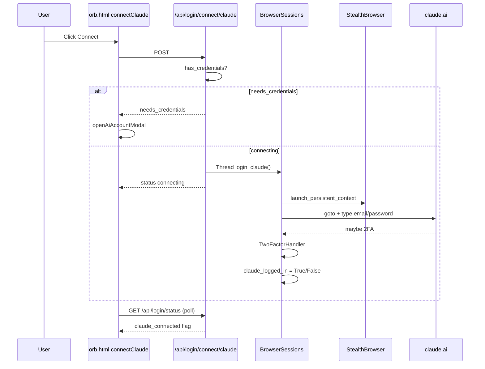
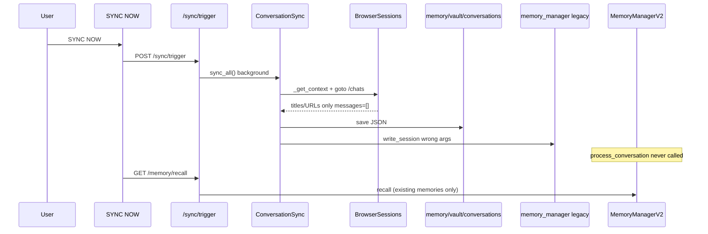

# AI Federation System Audit

**Date:** 2026-06-02  
**Scope:** Read-only audit of Connected AI / multi-provider infrastructure in SentinelAI  
**Constraint:** No code changes were made. Findings are evidence-based from repository search and trace-through.

---

## Executive Summary

There is **no module or package named “AI Federation”** or **“Connected AI”** in the codebase. Functionality is split across:

1. **Identity + browser sessions** (`workers/identity/`) — login, 2FA, Playwright persistent profile  
2. **Conversation sync** (`workers/sync/conversation_sync.py`) — pull chat **metadata** from Claude/ChatGPT  
3. **Consultation worker** (`workers/consultation/consultant.py`) — ask Claude/ChatGPT/Codex via **external SentinelWeb** HTTP API  
4. **Memory V2** (`workers/memory/memory_manager_v2.py`) — hot/warm/cold recall shown in Memory tab  
5. **Legacy memory manager** (`memory_manager.py`) — still used by sync ingestion (miswired)

**Gemini:** not implemented (no references in Python code).  
**memory_provider.py:** does not exist.  
**“Memory Merge” (unified federation index):** not implemented; only **project-plan merge** in `project_planner.py` (architecture text, not chat memory).

---

## EXISTS

| Component | File path | Purpose |
|-----------|-----------|---------|
| Identity / credentials | `workers/identity/identity_manager.py` | Encrypt credentials (Fernet + machine-derived key) at `~/.sentinelai/identity.enc` |
| Browser automation (login) | `workers/identity/browser_sessions.py` | Playwright login to Claude.ai + ChatGPT |
| Stealth / persistent browser | `workers/identity/stealth_browser.py` | Persistent Chromium profile `~/.sentinelai/browser_data/` |
| 2FA handler | `workers/identity/two_factor.py` | TOTP, Gmail email codes, ADB SMS |
| Gmail 2FA helper | `workers/identity/gmail_handler.py` | OAuth inbox polling for codes |
| Conversation sync | `workers/sync/conversation_sync.py` | Scheduled/manual sync; saves JSON under `memory/vault/conversations/` |
| Sync API | `desktop_app.py` (`/sync/status`, `/sync/trigger`, `/sync/conversations`) | Backend for Memory tab “SYNC NOW” |
| Login / connect API | `desktop_app.py` (`/api/login/*`) | Status, save creds, connect Claude/ChatGPT |
| Memory tab UI (Connected AI panel) | `desktop-shell/orb.html` (`loadMemoryPanel`, `connectClaude`, `connectChatGPT`) | AI CONNECTIONS + sync + recall |
| Memory V2 | `workers/memory/memory_manager_v2.py` | SQLite hot + Chroma warm + vault cold; `recall`, `remember`, `purge_by_source` |
| Memory V2 routes | `desktop_app.py` (`/memory/stats`, `/memory/recall`, …) | Powers Memory tab stats/search |
| Consultant | `workers/consultation/consultant.py` | ChatGPT → Claude → Ollama; Codex CLI for code |
| Consultation API | `desktop_app.py` (`/consultation/ask`, `/consultation/project`, …) | Orchestrator / planner integration |
| Project planner merge | `workers/consultation/project_planner.py` | Merges Claude + ChatGPT **architecture** responses via Ollama |
| Thread registry (metadata) | `workers/identity/thread_manager.py` | JSON registry `memory/vault/threads/registry.json` |
| Consultation status in health | `desktop_app.py` (~1128–1160) | Reports `codex_installed`, `chatgpt_reachable` (SentinelWeb) |
| Stealth + 2FA tests | `test_stealth_2fa.py` | Automated checks for 2FA/TOTP paths |

---

## PARTIALLY EXISTS

| Component | File path | What works | What is incomplete / broken |
|-----------|-----------|------------|------------------------------|
| **Connect Claude / ChatGPT** | UI: `orb.html` → API: `desktop_app.py:660–711` → `browser_sessions.login_*` | Button → API → background thread → Playwright navigation + credential fill | Success only if Playwright installed, selectors match live sites, creds saved; UI polls status after 1.5–3s (may show “connecting” before login finishes). **Consultation does not use this session** (uses SentinelWeb). |
| **Read Claude conversations** | `conversation_sync._extract_claude_async` | Can list chat links/titles from `/chats` when logged in | **`messages` never populated** — only title/URL/date metadata |
| **Read ChatGPT conversations** | `conversation_sync._extract_chatgpt_async` | Same for `/c/` links | **No message bodies** |
| **Index into Memory** | Sync saves JSON; `_process_into_memory` | JSON files in `memory/vault/conversations/` | Ingestion calls **`memory_manager.write_session` with wrong signature** (see BROKEN); **does not call** `memory_v2.process_conversation` or `remember()` |
| **Memory tab “Recent Memories”** | `orb.html` → `/memory/recall` → `memory_v2.recall` | Search/recall over V2 store when initialized | **Not fed by sync pipeline** unless something else called `remember()` with source `claude`/`chatgpt` |
| **Ask Claude / ChatGPT** | `consultant.ask_*` → SentinelWeb `POST /ask` | Works when **SentinelWeb** on `localhost:8766` is up | **Separate service**, not in this repo; falls back to Ollama when down |
| **Ask Codex** | `consultant.ask_codex` | CLI subprocess if `codex` on PATH | Optional; not browser-based |
| **2FA** | `browser_sessions._handle_post_login` + `TwoFactorHandler` | Detects OTP fields; TOTP/Gmail/ADB if configured | UI modal saves `claude_2fa_method: 'none'` by default (`orb.html:3800–3805`); TOTP secret rarely configured |
| **Session restore** | `stealth_browser.launch_context` persistent dir | Cookies/storage persist under `~/.sentinelai/browser_data` | **In-memory** `claude_logged_in` flags reset on app restart until `startup_login()` runs again |
| **Thread manager** | `thread_manager.py` | Registry load/save | **Not referenced** from sync, consultant, or browser_sessions in grep — **unwired** |

---

## BROKEN

| Issue | Evidence |
|-------|----------|
| **Sync → legacy memory API mismatch** | `conversation_sync.py:150–156` calls `mm.write_session({dict})` but `memory_manager.py:33` requires `write_session(session_id: str, summary_dict)`. First argument becomes stringified dict — not valid session ingestion. |
| **Dual memory systems** | Memory tab uses **Memory V2** (`/memory/recall`). Sync uses **legacy** `memory_manager` only. Sync never calls `memory_v2.remember` / `process_conversation`. |
| **Consultation vs login session split** | Login: `BrowserSessions` in SentinelAI. Consultation: `SENTINELWEB_URL` (`consultant.py:24–140`). Two stacks; connecting in Memory tab does **not** enable consultation browser asks. |
| **Health “claude_reachable”** | `desktop_app.py:1134–1135` sets `claude_reachable` from `_sentinelweb_available()` — **not** from `browser_sessions.claude_logged_in`. Misleading for “Connected AI” in Memory tab. |

---

## MISSING

| Expected capability | Finding |
|--------------------|---------|
| **“AI Federation” / “Connected AI” named module** | No matches in repo (grep `Federation`, `AI-FEDERATION`, `Connected AI`) |
| **memory_provider.py** | File does not exist |
| **Gemini provider** | No Python integration |
| **Unified memory merge** (Claude + ChatGPT + local → single index) | No merge engine; only planner `merge_plans()` for build architecture |
| **`[AI-FEDERATION]` diagnostic logs** | Not present (user-requested log lines were **not added** per audit-only scope) |
| **Full conversation body ingestion** | Extractors do not open threads or scrape messages |
| **SentinelWeb in-repo** | External project (`C:\Users\pgg12\Desktop\SentinelWeb` referenced in errors only) |
| **TPM-backed session storage** | Credentials use Fernet+machine key; browser uses plaintext profile dir — not TPM |
| **Wire ThreadManager to live chats** | Registry unused in main flows |

---

## Component Inventory (detailed)

| Name | File path | Purpose | Status |
|------|-----------|---------|--------|
| IdentityManager | `workers/identity/identity_manager.py` | Encrypted credential vault | **Wired** — startup + `/api/login/*` |
| BrowserSessions | `workers/identity/browser_sessions.py` | Playwright login + session flags | **Partially wired** — connect + startup |
| StealthBrowser | `workers/identity/stealth_browser.py` | Anti-bot + persistent context | **Wired** via BrowserSessions |
| TwoFactorHandler | `workers/identity/two_factor.py` | 2FA automation | **Partial** — needs creds/config |
| GmailHandler | `workers/identity/gmail_handler.py` | Email 2FA codes | **Optional** |
| ADBHandler | `workers/identity/adb_handler.py` | SMS 2FA | **Optional** |
| ConversationSync | `workers/sync/conversation_sync.py` | Pull conversation list | **Partial** — metadata only |
| ThreadManager | `workers/identity/thread_manager.py` | Thread registry | **Unwired** |
| Consultant | `workers/consultation/consultant.py` | External AI consultation | **Partial** — needs SentinelWeb |
| ProjectPlanner | `workers/consultation/project_planner.py` | Multi-AI architecture planning | **Wired** — separate from Memory tab |
| MemoryManagerV2 | `workers/memory/memory_manager_v2.py` | 3-layer memory + recall | **Wired** — Memory tab recall |
| MemoryManager (legacy) | `memory_manager.py` | Markdown vault sessions | **Miswired** from sync |
| Login UI modal | `desktop-shell/orb.html` (`#ai-account-modal`) | Save credentials | **Wired** |
| Memory panel | `desktop-shell/orb.html` (`loadMemoryPanel`) | Connected AI + sync + recall | **Wired** (with gaps above) |

---

## Authentication Audit

### 1. Does Connect Claude button work?

**UI path:** `orb.html` `connectClaude()` (~3840) → `POST http://127.0.0.1:5001/api/login/connect/claude`

**Backend path:** `desktop_app.py` `api_login_connect_claude()` (660–685):

- Requires `identity_manager.has_credentials()` else `needs_credentials` → opens modal  
- Starts daemon thread → `browser_sessions.login_claude()` → `browser_sessions._login_claude_async()` (140–179)

**Verdict:** **PARTIAL** — code path is complete; real success depends on Playwright, site DOM, credentials, 2FA. Returns `connecting` immediately; UI rechecks status on timer.

### 2. Does Connect ChatGPT button work?

Same pattern: `connectChatGPT()` → `/api/login/connect/chatgpt` → `login_chatgpt()` (688–711, 181–216).

**Verdict:** **PARTIAL** (same constraints).

### 3. Is browser automation implemented?

**Yes.** Playwright + `StealthBrowser.launch_context()` (`stealth_browser.py:71–98`), used from `browser_sessions._get_context()`.

### 4. Is login actually attempted?

**Yes**, when credentials exist: `goto` login URLs, `human_type` email/password, submit (`browser_sessions.py` 140–216).

### 5. Is 2FA detection implemented?

**Yes.** `browser_sessions._handle_post_login` (218–247) queries OTP selectors; calls `TwoFactorHandler.handle_2fa_prompt_async`.

### 6. Are sessions persisted?

**Browser profile:** **Yes** — Chromium persistent context at `~/.sentinelai/browser_data` (`stealth_browser.py:36–37`).  
**Login flags:** **No** — `claude_logged_in` / `chatgpt_logged_in` are process-local booleans reset on restart.  
**Credentials:** **Yes** — `~/.sentinelai/identity.enc` (encrypted).

### 7. Are sessions restored?

**Cookies/storage:** Restored via persistent browser profile on next Playwright launch.  
**Auto-login on startup:** `desktop_app.py` `_start_browser_sessions()` (~6136) calls `browser_sessions.startup_login()` after 5s delay.  
**Validated “Connected ✓” in UI:** Only if `browser_sessions.*_logged_in` True when `/api/login/status` is polled (`desktop_app.py:577–589`).

---

## Memory Audit

| Capability | Status | Evidence |
|------------|--------|----------|
| Read Claude **conversations** (full text) | **NOT IMPLEMENTED** | `_extract_claude_async` only collects link titles (`conversation_sync.py:179–191`); `messages` stays `[]` |
| Read ChatGPT **conversations** (full text) | **NOT IMPLEMENTED** | `_extract_chatgpt_async` same (`211–224`) |
| Read Claude **list/metadata** | **PARTIAL** | Titles/URLs when session logged in |
| Read ChatGPT **list/metadata** | **PARTIAL** | Same |
| Index Claude into Memory V2 | **NOT IMPLEMENTED** | Sync does not call `memory_v2.remember` / `process_conversation` |
| Index ChatGPT into Memory V2 | **NOT IMPLEMENTED** | Same |
| Index via legacy path | **BROKEN** | Wrong `write_session` call (`conversation_sync.py:150–156` vs `memory_manager.py:33`) |
| Merge memories (federation) | **NOT IMPLEMENTED** | No merge module; planner merges architecture strings only |
| Memory tab display | **WORKING** (local recall) | `/memory/recall` + `memory_v2` (`desktop_app.py:762–771`, `orb.html:3892–3923`) |
| SYNC NOW | **PARTIAL** | Triggers `sync_all()` (`/sync/trigger`); extraction limited; ingestion broken |

---

## Session Storage Audit

| Store | Path | Format | Encrypted? | TPM? |
|-------|------|--------|------------|------|
| Credentials | `~/.sentinelai/identity.enc` | Fernet blob (JSON inside) | **Yes** (machine-derived key, `identity_manager.py:24–49`) | **No** |
| Browser session | `~/.sentinelai/browser_data/` | Chromium user data dir (cookies, local storage) | **No** (standard browser profile) | **No** |
| Sync state | `memory/vault/sync_state.json` | Plain JSON | **No** | **No** |
| Conversation exports | `memory/vault/conversations/*.json` | Plain JSON | **No** | **No** |
| Thread registry | `memory/vault/threads/registry.json` | Plain JSON | **No** | **No** |
| Memory V2 hot | `memory/hot_memory.db` | SQLite | **No** | **No** |
| Memory V2 cold | `memory/vault/**/*.md` | Markdown | **No** | **No** |
| Chat session buffer | In-process `_chat_session` | RAM (`desktop_app.py:1703–1716`) | N/A | N/A |

**Sentinel Security** (`sentinel_security/secrets_store.py`) is separate; not wired to AI Federation login flow in this audit.

---

## AI Consultation Audit

| Provider | Can Sentinel ask? | Execution path | Status |
|----------|-----------------|----------------|--------|
| **ChatGPT** | Yes (if SentinelWeb up) | `consultant.consult_for_guidance` → `ask_chatgpt` → `POST {SENTINELWEB_URL}/ask` (`consultant.py:142–149, 195–198`) | **PARTIAL** |
| **Claude** | Yes (fallback) | `ask_claude` → SentinelWeb `site=claude` (`consultant.py:151–158, 200–203`) | **PARTIAL** |
| **Codex** | Yes (CLI) | `ask_codex` → `subprocess ["codex", prompt]` (`consultant.py:98–111, 223–226`) | **PARTIAL** (install-dependent) |
| **Gemini** | **No** | — | **NOT IMPLEMENTED** |
| **Ollama** | Yes (fallback) | `_ask_ollama` → local API (`consultant.py:162–173, 205–210`) | **WORKING** (local) |

**Orchestrator routing:** `desktop_app.py` (~5046–5060) can call `consultant.consult_for_guidance` for architecture/guidance queries.

**Important:** Consultation **does not** use `BrowserSessions` from the Memory tab connect flow.

---

## UI Audit (Memory tab — not main chat UI)

| UI element | API | Backend function |
|------------|-----|------------------|
| Memory tab load | — | `loadMemoryPanel()` `orb.html:3679` |
| Connection status dots | `GET /api/login/status` | `api_login_status()` `desktop_app.py:~540` |
| **Connect** Claude | `POST /api/login/connect/claude` | `api_login_connect_claude()` → `BrowserSessions.login_claude()` |
| **Connect** ChatGPT | `POST /api/login/connect/chatgpt` | `api_login_connect_chatgpt()` → `login_chatgpt()` |
| Save credentials (modal) | `POST /api/login/save` | `api_login_save()` → `IdentityManager.save_credentials()` |
| **SYNC NOW** | `POST /sync/trigger` | `sync_trigger()` → `ConversationSync.sync_all()` |
| Memory stats | `GET /memory/stats` | `memory_stats()` → `memory_v2.get_stats()` |
| Search / recent | `GET /memory/recall?q=…` | `memory_recall()` → `memory_v2.recall()` |
| Filter claude/chatgpt | Client-side on recall results | — |
| Purge source | `DELETE /memory/purge/source/{source}` | `memory_purge_source()` |
| Previous sessions | `GET /api/memory/sessions` | `api_memory_sessions()` → `memory_v2.get_chat_sessions()` |
| Settings API keys (separate) | Settings panel | Anthropic/OpenAI keys — **API keys**, not browser federation |

**Note:** Main **chat UI** orchestration uses OpenClaw/Ollama paths; Connected AI is concentrated in the **Memory** panel per `orb.html`.

---

## Logging Audit

Requested `[AI-FEDERATION]` diagnostics were **not added** (audit-only; no code changes).

| Requested log | Current state |
|---------------|---------------|
| Connect Claude clicked | **MISSING** — UI has no such log; backend logs via `log(..., 'identity')` on connect |
| Login started | **PARTIAL** — `[identity] Browser session startup beginning...` (`browser_sessions.py:117`) |
| Browser launched | **PARTIAL** — implicit in Playwright context creation; no explicit “Browser launched” |
| 2FA detected | **EXISTS** — `2FA prompt detected for {service}` (`browser_sessions.py:231`) |
| Session persisted | **MISSING** — no log on profile write; persistent context saves silently |

Existing prefixes: `[Identity]`, `[Sync]`, `[Consultant]`, `[2fa]`, `[MemV2]`.

---

## Architecture Diagram

```mermaid
flowchart TB
  subgraph UI["desktop-shell/orb.html — Memory Tab"]
    MC[Connect Claude / ChatGPT]
    MS[SYNC NOW]
    MR[Memory Recall UI]
  end

  subgraph API["desktop_app.py :5001"]
    L[/api/login/*]
    S[/sync/*]
    MV2[/memory/*]
    C[/consultation/*]
  end

  subgraph Identity["workers/identity"]
    IM[IdentityManager<br/>~/.sentinelai/identity.enc]
    BS[BrowserSessions<br/>Playwright]
    SB[StealthBrowser<br/>~/.sentinelai/browser_data]
    TF[TwoFactorHandler]
  end

  subgraph Sync["workers/sync"]
    CS[ConversationSync<br/>metadata extract]
  end

  subgraph Mem["Memory Systems"]
    V2[MemoryManagerV2<br/>hot_memory.db + Chroma + vault]
    LEG[memory_manager.py<br/>legacy markdown]
  end

  subgraph Consult["workers/consultation"]
    CON[Consultant]
    PP[ProjectPlanner merge_plans]
  end

  subgraph External["External — not in repo"]
    SW[SentinelWeb :8766<br/>/ask chatgpt|claude]
    OLL[Ollama :11434]
    CDX[Codex CLI]
  end

  MC --> L
  MS --> S
  MR --> MV2
  L --> IM
  L --> BS
  BS --> SB
  BS --> TF
  S --> CS
  CS --> BS
  CS -.->|broken write_session| LEG
  CS -.->|not wired| V2
  C --> CON
  CON --> SW
  CON --> OLL
  CON --> CDX
  PP --> CON
```

---

## Authentication Flow Diagram



---

## Memory Sync Flow Diagram



---

## Highest-Priority Fixes (documentation only — not implemented)

1. **Wire sync ingestion to Memory V2** — Call `memory_v2.process_conversation()` or `remember()` from `conversation_sync._process_into_memory`; remove or fix legacy `write_session` misuse.  
2. **Extract message bodies** — Extend Playwright scrapers to open each chat and populate `Conversation.messages` (or dedicated ingest).  
3. **Unify browser stacks** — Either route `Consultant` through `BrowserSessions` or document/deploy SentinelWeb as mandatory; align `/api/login/status` “reachable” with actual consultation path.  
4. **Fix health/consultation status** — Report `browser_sessions.*_logged_in` separately from `SentinelWeb` reachability.  
5. **Wire or remove ThreadManager** — Use for consultation thread reuse or delete dead code.  
6. **Add `[AI-FEDERATION]` structured logging** — Connect click, browser launch, 2FA, persist, sync start/complete (if product still uses that name).  
7. **Credential modal 2FA fields** — Surface TOTP/Gmail/ADB methods in `saveAiAccountCredentials` (currently hardcoded `none`).  
8. **Clarify product naming** — “Connected AI” = Memory panel; “Federation” = consultation + planner merge only today.

---

## Search Term Results (repository-wide)

| Term | Result |
|------|--------|
| Claude | Identity, sync, consultation, UI — **many hits** |
| ChatGPT | Same |
| Codex | `workers/consultation/consultant.py` only |
| Gemini | **No Python implementation** |
| Connected AI | Marketing copy in `orb.html` / website only |
| Federation | **No code** |
| Memory Merge | Planner architecture merge only |
| Browser Session | `workers/identity/browser_sessions.py` |
| memory_provider.py | **Not found** |

---

*End of audit. No fixes applied.*
