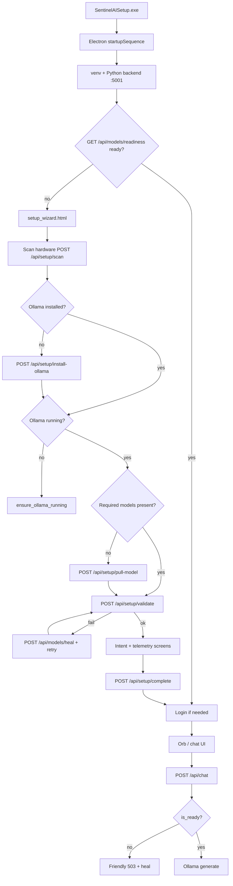

# First Launch Flow

End-to-end path from installer to operational Sentinel (no command line).

## Flow diagram

## Electron gating (`desktop-shell/main.js`)

1. **Removed** blocking dialog: “Start ollama serve”.
2. **Wizard loop** — `while (isWizardNeeded() || isSetupRequired())` opens `setup_wizard.html` until `/api/models/readiness` reports `ready: true`.
3. Closing the wizard window without completion reopens the loop (no `.wizard_done` flag).

## Wizard screens (`setup_wizard.html`)

| Screen | Purpose |
|--------|---------|
| 0 | System scan |
| 1 | Profile + automatic Ollama/model setup (no Skip) |
| 2 | Inference validation |
| 3 | Use-case intent |
| 4 | Telemetry opt-in → `POST /api/setup/complete` → IPC `setup-wizard-done` |

## Python orchestrator (`core/onboarding/first_launch.py`)

Steps aligned with the same pipeline:

`welcome` → `system_scan` → `dependencies` (Ollama + deps) → `models` (pull) → `model_validation` (heal + validate) → `account` → `license` → `ready`

`is_complete()` returns true only when `FirstLaunchOrchestrator.completed` **and** `ModelRuntime.is_ready()`.

API: `GET /api/onboarding/status`, `POST /api/onboarding/step`

## Required models (beta)

| Role | Typical tags | When skipped |
|------|----------------|--------------|
| Llama (fallback) | `llama3.2:3b` / `llama3.1:8b` | Never |
| Dolphin (primary) | `dolphin3:8b` / `dolphin-mistral:7b` | Low RAM/VRAM per `ModelManager.recommend()` |

Legacy `qwen2.5-coder:*` recommendations in old scans are replaced by Llama/Dolphin at setup time.

## User-visible messages

All failure paths use `ModelRuntime.user_message()` — short status text only (e.g. “Downloading language models for your hardware…”). Raw exceptions stay in server logs.

## Fresh Windows checklist

- [ ] Install `SentinelAISetup.exe`
- [ ] Launch Sentinel — wizard appears automatically
- [ ] Wait for Ollama + model downloads (progress bar)
- [ ] Validation screen shows “Sentinel AI is ready”
- [ ] Complete intent/telemetry
- [ ] Orb opens; first chat message gets a real model reply
