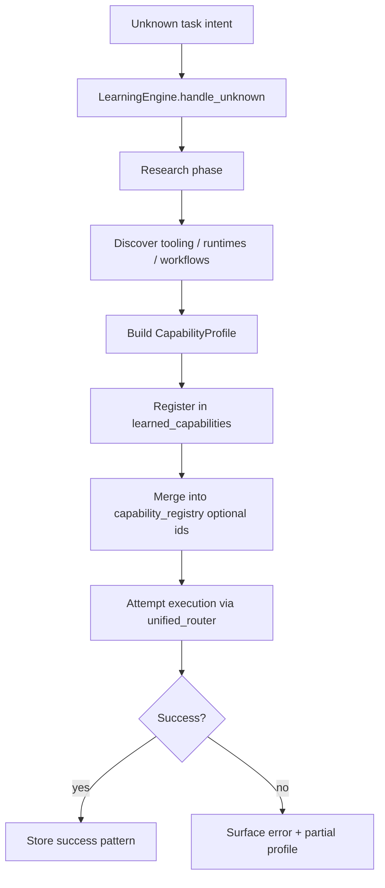

# Learning Engine Architecture

## Philosophy

**Prefer learning over refusal.**

| Old | New |
|-----|-----|
| “I can’t do that.” | “I don’t know how yet — researching capability…” |
| Silent failure | Registered capability profile + retry |

The Learning Engine is **not** a replacement for `learning.py` (Earn PR pattern memory). It is a **platform-level** capability acquisition loop.

---

## Placement

```
core/learning/
  learning_engine.py    # Orchestrates research → profile → register → retry
  capability_profiles.py  # (future) schema for learned profiles
```

**Storage:** `memory/vault/learned_capabilities/registry.json`

---

## Workflow



### Phases

1. **Research** — Web/docs search (future: consultation fallback), inventory existing Sentinel modules.
2. **Discover** — Required binaries, APIs, env vars, typical CLI workflows.
3. **Profile** — JSON profile: `id`, `label`, `domain`, `dependencies[]`, `install_steps[]`, `verify_command`, `executor` (module path).
4. **Register** — Append to learned registry; optional promotion to `core/capabilities/capability_registry.py` via config reload (manual review).
5. **Execute** — Delegate to `CapabilityManager.ensure_capabilities()` then appropriate engine.
6. **Learn** — Record outcome in profile `success_count` / `last_error`.

---

## Integration Points

| System | Hook |
|--------|------|
| Unified router | If no engine match + high ambiguity → `learning` |
| Capability manager | `register_learned_capability(profile)` |
| Task manager | `source="learning"`, stages: Research → Discover → Register → Attempt |
| Chat | Sentinel voice: “Researching how to …” |
| Consultation (optional) | Claude/ChatGPT for workflow hints — **not required** |

---

## Current Implementation Status

| Piece | Status |
|-------|--------|
| `LearningEngine` class | **Skeleton** — registry load/save, `handle_unknown()`, `register_profile()` |
| Automated web research | **Not implemented** — returns structured “researching” task |
| Auto-install from learned profile | **Not implemented** — uses existing `runtime_installer` when ids known |
| UI in Tasks tab | **Partial** — tasks via `TaskContext` when caller wires it |

---

## Safety

- No automatic install of unsigned binaries without bootstrap manifest alignment.
- Learned capabilities default to **Tier 3** until reviewed.
- Guardian/offensive profiles require trusted-target + mode gates unchanged.

---

## Next Milestones

1. Wire `api_chat` unknown-code paths to `LearningEngine.handle_unknown()`.
2. Research backend: Ollama plan + optional `consultant.consult_for_guidance()` (enhancement only).
3. Human-review queue in Memory vault for promoted capabilities.
4. Merge successful profiles into `DOMAIN_CAPABILITIES` at runtime (config overlay file).
