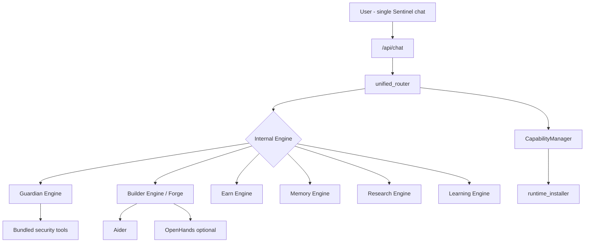

# Orchestration Architecture

## Principle

**Sentinel orchestrates proven software.** It does not reimplement years of agent framework work.

| Tool | Role in Sentinel | Status |
|------|------------------|--------|
| **Aider** | Python/code repair, fallback builder | **Integrated** (`workers/aider_engine.py`) |
| **OpenHands** | Optional pre-native codegen | **Stub** (`openhands_worker.py`) |
| **Playwright** | Login sync, browser automation | **Partial** (identity/sync) |
| **Guardian CLI tools** | httpx, subfinder, katana, nuclei, … | **Integrated** |
| **Ollama** | Local LLM | **Integrated** |
| **Godot runtime** | GAME launch | **Integrated** |
| **LangGraph/CrewAI** | Supervised workflows | **Parallel** (`orchestration/`) |

---

## Layers



---

## Routing Tables

### Task routing (`workers/sentinel/unified_router.py`)

| Intent signal | Internal engine | User-facing |
|---------------|-----------------|-------------|
| build/create/implement | `forge` | Sentinel |
| scan/pentest/recon/guardian | `guardian` | Sentinel |
| bounty/research program | `earn_research` | Sentinel |
| bounty/jobs/freelance | `earn` | Sentinel |
| market/crypto price | `market` | Sentinel |
| home automation | `home` | Sentinel |
| architecture guidance | `consultation` | Sentinel |
| default conversational | `general` | Sentinel |

### Capability routing

Before engine execution:

```
CapabilityManager.ensure_for_domain(domain)
  → validate_capability
  → install_capability (if Tier 1/2 auto)
  → block or continue with errors[]
```

### Tool routing (Guardian)

`GuardianBrain` → `tool_registry` → concrete tool classes. Bootstrap ensures binaries.

### Execution flow (Builder — canonical)

See `FORGE_EXECUTION_PIPELINE.md`:

Planning → Dependency Check → Install → Generate → Build → Verify → **Launch** → Repair → Complete.

---

## Approval Gates

| Flow | Gate |
|------|------|
| Forge via `/api/chat` | User **APPROVE** pending task |
| Forge via `/orchestration/chat` | **No gate** (inconsistency — converge on approve) |
| Guardian offensive lab | Mode + ack |
| Earn research | No auto-submit |

**Recommendation:** Single `_store_pending_task` for all long-running user-confirmed operations.

---

## What Not To Build

- New codegen agent from scratch
- Duplicate task queue (pick `task_manager` + unify LangGraph metadata into Tasks tab)
- Second capability system (extend `core/capabilities`)

---

## Migration Path

1. **Now:** `unified_router` classifies; `api_chat` executes guardian + earn research.
2. **Next:** Pipeline `_execute_subtask` calls same router executors.
3. **Later:** Deprecate `/orchestration/chat` or make alias of `/api/chat`.
