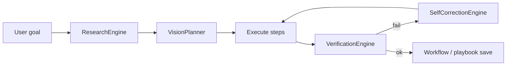

# Sentinel Vision — Operator Architecture

**Package:** `core/sentinelvision/`  
**UI:** Settings → **Sentinel Vision**  
**API:** `/api/sentinelvision/*` (legacy: `/api/sentinelscrub/*`)  
**Socket:** `sentinelvision_event` (legacy: `sentinelscrub_event`)

## Mission

Sentinel Vision is the **eyes, operator, and autonomous execution layer** of Sentinel AI. It merges the former SentinelScrub subsystem with expanded provider onboarding, account operations, and a workflow library.

Responsibilities:

- Visual understanding (DOM, text, OCR, vision model)
- Browser operation (Playwright)
- Desktop operation (shell commands, platform helpers)
- Provider operation (Supabase, Stripe, GitHub, Cloudflare, Netlify, Resend, Google, Amazon)
- Research and planning
- Verification
- Repair and self-correction

## Pipeline

## Module map

| Area | Path | Role |
|------|------|------|
| Engine | `engine.py` | Goal queue, pipeline, multi-step, metrics |
| Goals | `goal_engine.py` | SQLite goals + feed |
| Browser | `operator/browser/` | Playwright, `smart_click` fallback chain |
| Desktop | `operator/desktop/` | OS commands |
| Accounts | `operator/account_operator.py` | Login, vault, env vars |
| Onboarding | `provider_onboarding/` | `ProviderOnboardingEngine` |
| Providers | `providers/` | Per-provider executors + HTTP workflows |
| Vault | `vault/account_vault.py` | Encrypted credentials (`vision:vault:`) |
| Workflows | `workflows/workflow_library.py` | Built-in templates + saved playbooks |
| Self-correction | `self_correction/` | Classify failures, repair memory, retry |
| Approval | `approval/` | Purchases and sensitive actions |

## Interaction fallback (browser)

1. DOM selectors  
2. Text matching (Playwright `get_by_text`)  
3. OCR (`ocr_bridge.py`, optional pytesseract)  
4. Vision model (`vision_bridge.py`, Ollama)

## Data

| Store | Path |
|-------|------|
| Goals | `data/sentinelvision/goals.db` |
| Repair memory | `data/sentinelvision/repair_memory.db` |
| Workflows / playbooks | `data/sentinelvision/workflows/` |
| Screenshots | `data/sentinelvision/screenshots/` |
| Audit | `data/sentinelvision/audit.jsonl` |
| Autonomy metrics | `data/sentinelvision/autonomy_metrics.db` |

Legacy `data/sentinelscrub/` paths are read where applicable (playbooks, DB migration by use).

## Boot

Initialized in `desktop_app.py` via `get_vision_engine(socketio)` — **non-fatal** on failure.

## Compatibility

- `core/sentinelscrub/__init__.py` re-exports `get_scrub_engine` → `get_vision_engine`
- API and socket events duplicated for older clients
